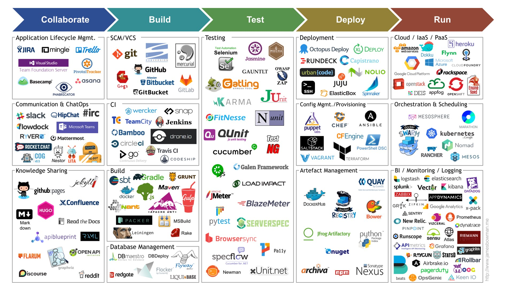
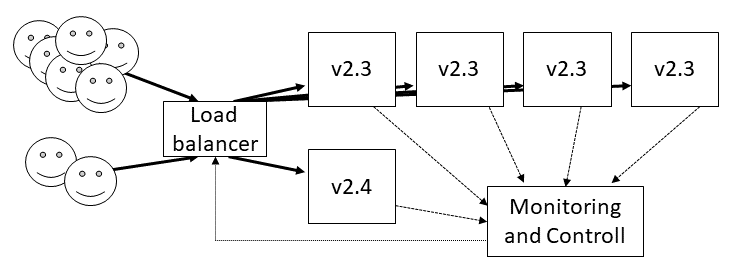
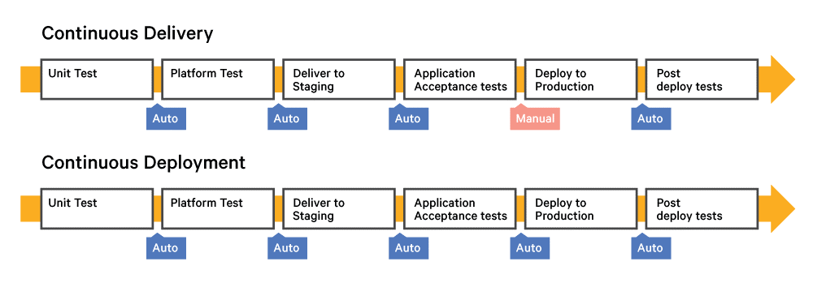

# DevOps

Christian Kaestner

---
# Learning Goals

* Understand the challenges of delivering implementations into operations
* Deploy a service for models using container infrastructure
* Basic overview of key tools 
* Design and implement a canary infrastructure

---
# Dev vs. Ops


<!-- .element: class="stretch" -->

----
## Common Release Problems?

<!-- discussion -->

----
## Common Release Problems (Examples)

* Missing dependencies
* Different compiler versions or library versions
* Different local utilities (e.g. unix grep vs mac grep)
* Database problems
* OS differences
* Too slow in real settings
* Difficult to roll back changes
* Source from many different repositories
* Obscure hardware? Cloud? Enough memory?

----
## Developers


* Coding
* Testing, static analysis, reviews
* Continuous integration
* Bug tracking
* Running local tests and scalability experiments
* ...

<!-- split -->
## Operations

* Allocating hardware resources
* Managing OS updates
* Monitoring performance
* Monitoring crashes
* Managing load spikes, …
* Tuning database performance
* Running distributed at scale
* Rolling back releases
* ...

QA responsibilities in both roles

----

## Quality Assurance does not stop in Dev

* Ensuring product builds correctly (e.g., reproducible builds)
* Ensuring scalability under real-world loads
* Supporting environment constraints from real systems (hardware, software, OS)
* Efficiency with given infrastructure
* Monitoring (server, database, Dr. Watson, etc)
* Bottlenecks, crash-prone components, … (possibly thousands of crash reports per day/minute)


---
# DevOps


----
## Key ideas and principles

* Better coordinate between developers and operations (collaborative)
* Key goal: Reduce friction bringing changes from development into production
* Considering the *entire tool chain* into production (holistic)
* Documentation and versioning of all dependencies and configurations ("configuration as code")
* Heavy automation, e.g., continuous delivery, monitoring
* Small iterations, incremental and continuous releases
* 
* Buzz word!
----

<!-- .element: class="stretch" -->


----
## Common Practices

* All configurations in version control
* Test and deploy in containers
* Automated testing, testing, testing, ...
* Monitoring, orchestration, and automated actions in practice
* Microservice architectures
* Release frequently

----
## Heavy tooling and automation



----
## Heavy tooling and automation -- Examples

* Infrastructure as code — Ansible, Terraform, Puppet, Chef
* CI/CD — Jenkins, TeamCity, GitLab, Shippable, Bamboo, Azure DevOps
* Test automation — Selenium, Cucumber, Apache JMeter
* Containerization — Docker, Rocket, Unik
* Orchestration — Kubernetes, Swarm, Mesos
* Software deployment — Elastic Beanstalk, Octopus, Vamp
* Measurement — Datadog, DynaTrace, Kibana, NewRelic, ServiceNow


---
# Canary Releases


Note: Caged canaries were used as early gas detectors in the early days of coal mining. Canaries are sensitive to methane and carbon monoxide, so they would detect dangerous gas build-ups. As long as the bird kept singing, the air was safe, whereas a dead canary would trigger an evacuation.

----
## Canary Releases

* Testing releases in production
* Incrementally deploy a new release to users, not all at once
* Monitor difference in outcomes (e.g., crash rates, performance, user engagement) 
* Automatically roll back bad releases
*
* Technically similar to A/B testing
* Telemetry essential

----

<!-- .element: class="stretch" -->
----
## Servers vs Feature Flags

<!-- colstart -->
* Deploy to subset of servers
* Route traffic with load balancer (e.g. per user)
* Separate machines, old release not affected
<!-- col -->
* Use feature flags to control change
* Deploy to all servers
* Serve features to select users
<!-- colend -->

----
## Canary Releases at Facebook

* Phase 0: Automated unit tests
* Phase 1: Release to Facebook employees
* Phase 2: Release to subset of production machines
* Phase 3: Release to full cluster
* Phase 4: Commit to master, rollout everywhere
* 
* Monitored metrics: server load, crashes, click-through rate

<!-- references -->
Further readings: 
* Tang, Chunqiang, Thawan Kooburat, Pradeep Venkatachalam, Akshay Chander, Zhe Wen, Aravind Narayanan, Patrick Dowell, and Robert Karl. [Holistic configuration management at Facebook](http://sigops.org/s/conferences/sosp/2015/current/2015-Monterey/printable/008-tang.pdf). In Proceedings of the 25th Symposium on Operating Systems Principles, pp. 328-343. ACM, 2015.
* Rossi, Chuck, Elisa Shibley, Shi Su, Kent Beck, Tony Savor, and Michael Stumm. [Continuous deployment of mobile software at facebook (showcase)](https://research.fb.com/wp-content/uploads/2017/02/fse-rossi.pdf). In Proceedings of the 2016 24th ACM SIGSOFT International Symposium on Foundations of Software Engineering, pp. 12-23. ACM, 2016.


----
## Recall: Feature Flags

```
  if (features.for({user:currentUser}).
       isEnabled("showReallyBigCheckoutButton")) {
      return renderReallyBigCheckoutButton();
   } else {
      return renderDefaultCheckoutButton();
   }
```

----
## Recall: Feature Flags


<!-- .element: class="stretch" -->


---
# Continuous Delivery and Continuous Deployment

----

<!-- references= -->
Source: https://www.slideshare.net/jmcgarr/continuous-delivery-at-netflix-and-beyond

----
## Typical Manual Steps in Deployment?

<!-- discussion -->
----
## Continuous Delivery

* Full automation from commit to deployable container
* Heavy focus on testing, reproducibility and rapid feedback
* Deployment step itself is manual
* Makes process transparent to all developers and operators

<!-- split -->
## Continuous Deployment

* Full automation from commit to deployment
* Empower developers, quick to production
* Encourage experimentation and fast incremental changes
* Commonly integrated with monitoring and canary releases
----

----


<!-- references -->

CC BY-SA 4.0, [G. Détrez](https://en.wikipedia.org/wiki/Continuous_delivery#/media/File:Continuous_Delivery_process_diagram.svg)
----
## Facebook Tests for Mobile Apps

* Unit tests (white box)
* Static analysis (null pointer warnings, memory leaks, ...)
* Build tests (compilation succeeds)
* Snapshot tests (screenshot comparison, pixel by pixel)
* Integration tests (black box, in simulators)
* Performance tests (resource usage)
* Capacity and conformance tests (custom)

<!-- references -->
Further readings: Rossi, Chuck, Elisa Shibley, Shi Su, Kent Beck, Tony Savor, and Michael Stumm. [Continuous deployment of mobile software at facebook (showcase)](https://research.fb.com/wp-content/uploads/2017/02/fse-rossi.pdf). In Proceedings of the 2016 24th ACM SIGSOFT International Symposium on Foundations of Software Engineering, pp. 12-23. ACM, 2016.

----
## Release Challenges for Mobile Apps

* Large downloads
* Download time at user discretion 
* Different versions in production
* Pull support for old releases?
*
* Server side releases silent and quick, consistent
* 
* -> App as container, most content + layout from server

----
# Real-world pipelines are complex

[](facebookpipeline.png)


---

# Containers and Configuration Management
----
## Containers

* Lightweight virtual machine
* Contains entire runnable software, incl. all dependencies and configurations
* Used in development and production
* Sub-second launch time
* Explicit control over shared disks and network connections

<!-- split -->


----
## Docker Example

```docker
FROM ubuntu:latest
MAINTAINER ...
RUN apt-get update -y
RUN apt-get install -y python-pip python-dev build-essential
COPY . /app
WORKDIR /app
RUN pip install -r requirements.txt
ENTRYPOINT ["python"]
CMD ["app.py"]
```

<!-- references -->
Source: http://containertutorials.com/docker-compose/flask-simple-app.html

----
## Common configuration management questions

* What runs where?
* How are machines connected?
* What (environment) parameters does software X require?
* How to update dependency X everywhere?
* How to scale service X?

----
## Ansible Examples

* Software provisioning, configuration management, and application-deployment tool
* Apply scripts to many servers

<!-- colstart -->
```ini
[webservers]
web1.company.org
web2.company.org
web3.company.org

[dbservers]
db1.company.org
db2.company.org

[replication_servers]
...
```
<!-- col -->
```yml
# This role deploys the mongod processes and sets up the replication set.
- name: create data directory for mongodb
  file: path={{ mongodb_datadir_prefix }}/mongo-{{ inventory_hostname }} state=directory owner=mongod group=mongod
  delegate_to: '{{ item }}'
  with_items: groups.replication_servers

- name: create log directory for mongodb
  file: path=/var/log/mongo state=directory owner=mongod group=mongod

- name: Create the mongodb startup file
  template: src=mongod.j2 dest=/etc/init.d/mongod-{{ inventory_hostname }} mode=0655
  delegate_to: '{{ item }}'
  with_items: groups.replication_servers


- name: Create the mongodb configuration file
  template: src=mongod.conf.j2 dest=/etc/mongod-{{ inventory_hostname }}.conf
  delegate_to: '{{ item }}'
  with_items: groups.replication_servers

- name: Copy the keyfile for authentication
  copy: src=secret dest={{ mongodb_datadir_prefix }}/secret owner=mongod group=mongod mode=0400

- name: Start the mongodb service
  command: creates=/var/lock/subsys/mongod-{{ inventory_hostname }} /etc/init.d/mongod-{{ inventory_hostname }} start
  delegate_to: '{{ item }}'
  with_items: groups.replication_servers

- name: Create the file to initialize the mongod replica set
  template: src=repset_init.j2 dest=/tmp/repset_init.js

- name: Pause for a while
  pause: seconds=20

- name: Initialize the replication set
  shell: /usr/bin/mongo --port "{{ mongod_port }}" /tmp/repset_init.js
```
<!-- colend -->

----
## Puppet Example

Declarative specification, can be applied to many machines

```puppet
$doc_root = "/var/www/example"

exec { 'apt-get update':
 command => '/usr/bin/apt-get update'
}

package { 'apache2':
 ensure  => "installed",
 require => Exec['apt-get update']
}

file { $doc_root:
 ensure => "directory",
 owner => "www-data",
 group => "www-data",
 mode => 644
}

file { "$doc_root/index.html":
   ensure => "present",
   source => "puppet:///modules/main/index.html",
   require => File[$doc_root]
}

file { "/etc/apache2/sites-available/000-default.conf":
   ensure => "present",
   content => template("main/vhost.erb"),
   notify => Service['apache2'],
   require => Package['apache2']
}

service { 'apache2':
   ensure => running,
   enable => true
}
```

Note: source: https://www.digitalocean.com/community/tutorials/configuration-management-101-writing-puppet-manifests

----
## Container Orchestration with Kubernetes

* Manages which container to deploy to which machine
* Launches and kills containers depending on load
* Manage updates and routing
* Automated restart, replacement, replication, scaling
* Kubernetis master controls many nodes

----


<!-- references -->
CC BY-SA 4.0 [Khtan66](https://en.wikipedia.org/wiki/Kubernetes#/media/File:Kubernetes.png)
----
## Monitoring

* Monitor server health
* Monitor service health
* Collect and analyze log files
* Dashboards and triggering automated decisions
* 
* Many tools, e.g., heapster, kibana, hawkular, and elastic.
* Common design: Pipe logs into Kafka stream, analyze stream

----
## Hawkular


<!-- source -->
https://www.hawkular.org/hawkular-apm/
----
## Hawkular


<!-- source -->
https://www.hawkular.org/hawkular-apm/


---
# DataOps?

<!-- discussion -->

---
# Summary

* Development vs Operations challenges
* Automation for continuous delivery and deployment
* Canary testing to roll out releases in production
* Telemetry and monitoring are key
* Many, many tools
