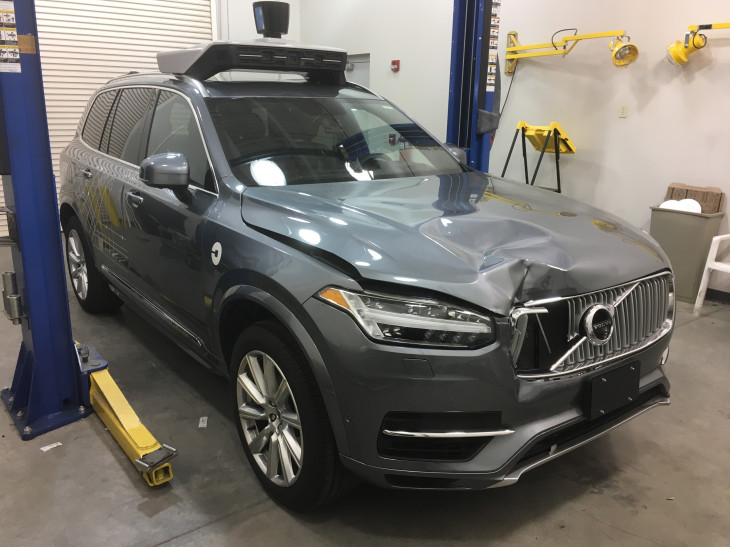
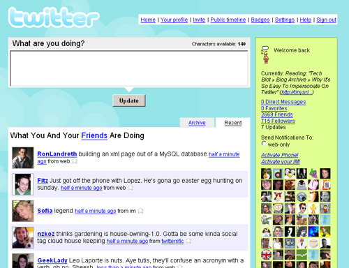
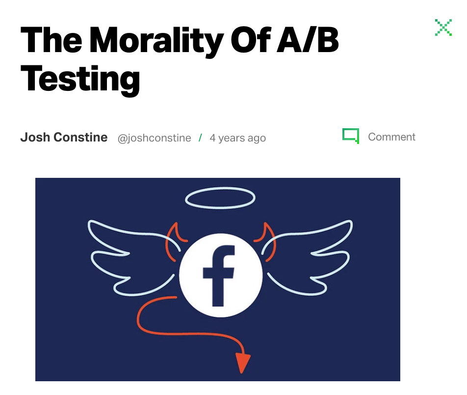
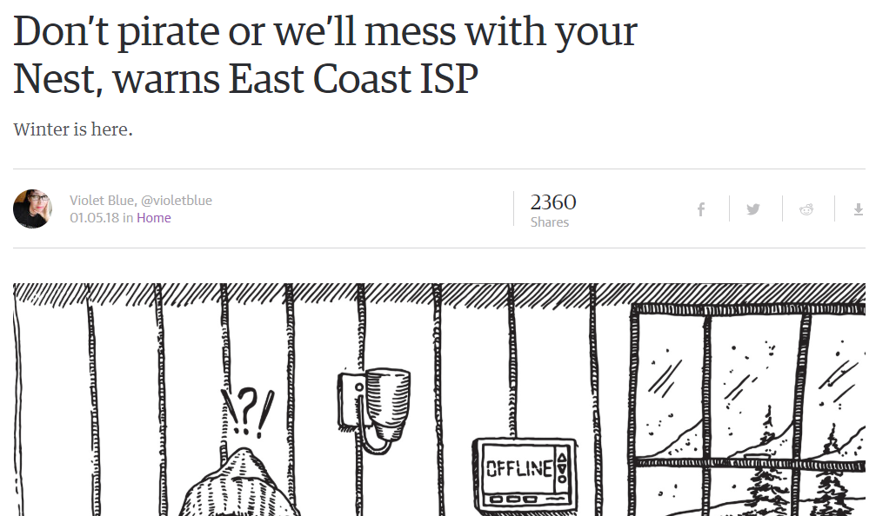
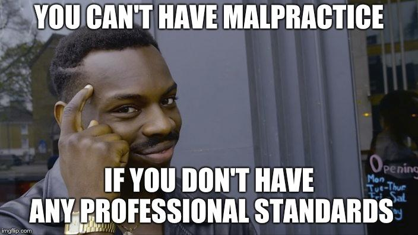

# Engineering Ethics

Christian Kaestner

---
# Learning Goals

* Awareness of ethical issues in software engineering
* Reflection on decision making
* Awareness of professional codes
* Starting points to dig deeper

---
<iframe width="800" height="600" src="https://www.youtube.com/embed/P_zRwq9c8LY?start=10" frameborder="0" allow="accelerometer; autoplay; encrypted-media; gyroscope; picture-in-picture" allowfullscreen></iframe>

----

---
# Legal / Moral / Ethical

----
# Legal / Moral / Ethical

* *Morality* governs private, personal interactions
* *Ethics* governs professional interactions
* *Law* governs society as a whole, often dealing with interactions between total strangers

---
# Case Study
----
## Les Paul Doodle

> “Update Jun 17: Wow—in just 48 hours in the U.S., you recorded 5.1 years worth of 
> music—40 million songs—using our doodle guitar. 
> And those songs were played back 870,000 times!“

----
<iframe width="800" height="600" src="https://www.youtube.com/embed/pi_SCJ7COw0" frameborder="0" allow="accelerometer; autoplay; encrypted-media; gyroscope; picture-in-picture" allowfullscreen></iframe>

----
## Les Paul Doodle

* Likely designed in days, side project
* Used by users for 5.3 million hours (8 lifetimes)
* Questions: Time sink, lost productivity? Negative or positive net contributions to the world? Who should consider cost/benefits? Based on what principles?

----
## [The code I’m still ashamed of](https://www.freecodecamp.org/news/the-code-im-still-ashamed-of-e4c021dff55e/)

<!-- .element: class="stretch" -->

----
<!-- .slide: data-background="boeing.jpg" data-background-size="contain" -->

## Boeing 

----
## Uber

----
# Legal / Moral / Ethical

----
## Dual Use

----
## Automation

Notes: The dangers and risks of automating jobs.

---
# AI and Unhealthy Interactions

----
## Twitter

Notes: What consequences should Twitter have foreseen? How should they intervene now that negative consequences of interaction patterns are becoming apparent?

----

<!-- references -->
Josh Constine. [The Morality Of A/B Testing](https://techcrunch.com/2014/06/29/ethics-in-a-data-driven-world/). TechCrunch. 2014

----

<!-- references -->

Web: [Center for Humane Technology](https://humanetech.com/)

---
# AI and Dependencies

----

----

---
# Unforseen Consequences?

----

----
## Bird

----

<!-- references -->

Catie Keck. (https://gizmodo.com/lime-reportedly-pulls-glitchy-e-scooters-in-switzerland-1831704890). Gizmodo. 2019

----
## Reported Scooter-Related Hazards

* Charging (“Bird hunters”) via gig economy, popular among students; compared to Pokemon go with pay; supposed to work at night; responsible for own safety
* Mugging in dark alleys 
* Scooters left on private property, even rail tracks
* Public littering and blocking bicycle lanes
* Additional traffic for charging and placing them in prominent locations; competition among chargers; impersonating company officials
* Hiding scooters until reward for retrieval is payed
* Scooters “chirp” eg when trying to steal, but often do -> noise polution

<!-- references -->

Taylor Lorenz. [Electric Scooter Charger Culture Is Out of Control](https://www.theatlantic.com/technology/archive/2018/05/charging-electric-scooters-is-a-cutthroat-business/560747/). The Atlantic. 2018

---
# Engineering Ethics

----
## Medical, Legal, Business, Engineering Ethics

* Many fields have well-developed professional ethics
* Basic ethical duty to *“hold paramount the safety, health and welfare of the public”*

<!-- split -->

http://ethics.wikia.com/wiki/Citicorp_Fiasco

----
## Hippocratic Oath

* I will not be ashamed to say "I know not," nor will I fail to call in my colleagues when the skills… 
* I will respect the privacy of my patients…
* I will prevent disease whenever I can, for prevention is preferable to cure.

----
## Professional Codes

* Codes for ethical practice
* Identify problems, guide solutions
* Judgement still necessary

----
## Malpractice vs. Negligence

----
<!-- small -->
## [IEEE CS/ACM Software Engineering Code of Ethics](https://ethics.acm.org/code-of-ethics/software-engineering-code/) (short version)
Software engineers shall commit themselves to making the analysis, specification, design, development, testing and maintenance of software a beneficial and respected profession. In accordance with their commitment to the health, safety and welfare of the public, software engineers shall adhere to the following Eight Principles: 
* Public: Software engineers shall act consistently with the public interest. 
* Client and Employer: Software engineers shall act in a manner that is in the best interests of their client and employer, consistent with the public interest. 
* Product: Software engineers shall ensure that their products and related modifications meet the highest professional standards possible. 
* Judgement: Software engineers shall maintain integrity and independence in their professional judgment. 
* Management: Software engineering managers and leaders shall subscribe to and promote an ethical approach to the management of software development and maintenance. 
* Profession: Software engineers shall advance the integrity and reputation of the profession consistent with the public interest. 
* Colleagues: Software engineers shall be fair to and supportive of their colleagues. 
* Self: Software engineers shall participate in lifelong learning regarding the practice of their profession and shall promote an ethical approach to the practice of the profession. 

<!-- references -->

https://ethics.acm.org/code-of-ethics/software-engineering-code/

----
## Ethics for Software Engineers and Data Sciensts?

* Softare engineers often have large autonomy (e.g. push to production)
* Fast release cycles
* Time and budget pressures

----
## Professional vs Personal Ethics

* “I was just following orders”
* Professionals serving the public, impact public welfare
* Ethical values/standards

---
# Summary

* Software engineers and data scientists face ethical questions regularly
* Most software and most models can potentially cause harm
* Fast decision making under constraints, slow down, reflect
* Professional codes can guide
